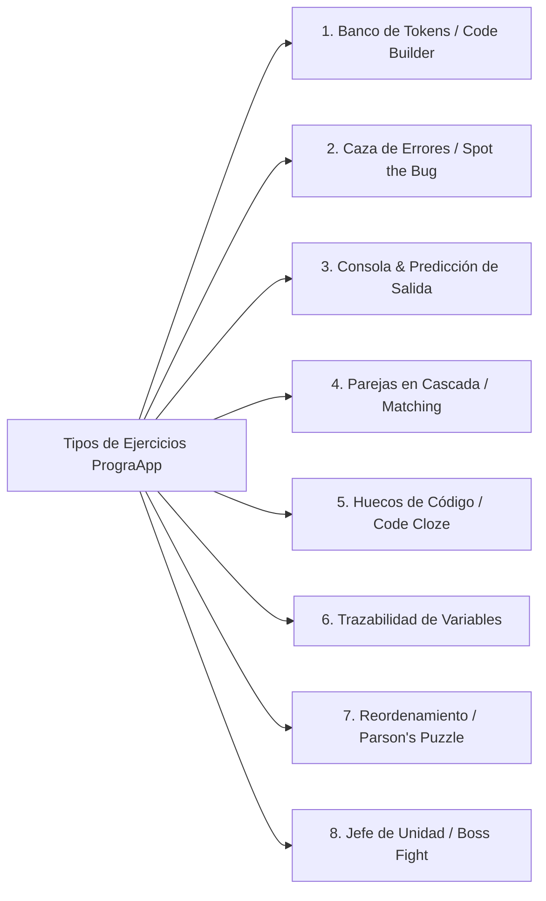
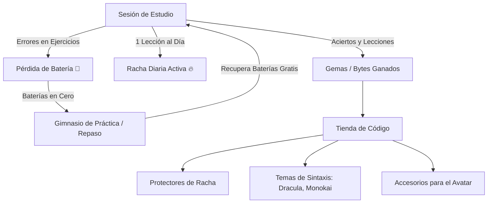

# Especificación Arquitectónica y de Diseño: PrograApp (Aprende Programando)

**Nombre del Producto:** PrograApp (o CodeByte: Tu Camino en el Código)  
**Visión del Producto:** Plataforma de aprendizaje activa, visual, adictiva y progresiva para dominar la lógica de programación aplicada a **Kotlin** y las bases de datos relacionales con **SQL**.  
**Filosofía de Diseño:** Inspirada en los principios de aprendizaje por micro-dosis, gamificación no punitiva y sensación táctil de **Duolingo**, adaptados al ecosistema y necesidades cognitivas de los futuros desarrolladores de software. Cero límites artificiales: diseñada como un sistema escalable con cientos de retos dinámicos y simulación de código interactiva.

---

## 1. Capa de Propósito, Alcance y Usuarios

### 1.1 Necesidad Formativa y Enfoque Cognitivo
Aprender a programar suele fracasar por la frustración temprana que generan los entornos de desarrollo complejos (IDE pesados, errores crípticos del compilador) y las explicaciones abstractas sin práctica inmediata. 
PrograApp resuelve esto fragmentando el conocimiento en:
- **Micro-retos interactivos (Bite-sized learning):** Sesiones enfocadas de 3 a 7 minutos.
- **Interacción física con la sintaxis:** Tocar, arrastrar, ordenar y depurar código en lugar de solo leer o memorizar.
- **Andamiaje cognitivo (Scaffolding):** La complejidad asciende de forma suave y basada en prerrequisitos directos.

### 1.2 Usuarios y Roles
- **Estudiante / Usuario Único:** Experiencia 100% enfocada en el aprendiz. Puede cursar las rutas de **Kotlin**, **SQL** o ambas en paralelo sin interferencia entre sus progresos.
- **Acceso Democrático:** Funciona tanto en dispositivos móviles (pantalla vertical táctil) como en navegadores de escritorio (PC/Web).
- **Offline-First:** Permite estudiar, responder lecciones y practicar sin conexión a internet, sincronizando automáticamente los avances al conectarse.

---

## 2. Capa Pedagógica y de Contenidos (Currículo Expandido)

### 2.1 Jerarquía Estructural de Aprendizaje
El aprendizaje no es lineal aburrido; se organiza en un sistema modular jerárquico:

$$\text{Ruta (Kotlin / SQL)} \longrightarrow \text{Unidad Temática} \longrightarrow \text{Nivel / Estación (3 Estrellas de Dominio)} \longrightarrow \text{Lección Dinámica} \longrightarrow \text{Banco de Retos (15 a 30 por lección)} \longrightarrow \text{Jefe de Unidad (Boss Challenge)}$$

Cada nivel cuenta con 3 estrellas o coronas de maestría:
1. **Estrella 1 (Fundamentos):** Conceptos guiados con pistas activas y opciones asistidas.
2. **Estrella 2 (Práctica Autónoma):** Ejercicios con menor asistencia y mayor variedad sintáctica.
3. **Estrella 3 (Maestría & Velocidad):** Retos de depuración rápida y predicción de consola sin pistas.

---

### 2.2 Mecánicas de Retos Interactivas (Estilo Duolingo adaptado a Código)

Para garantizar que no haya límites en la interactividad, la app incluye 8 tipos de ejercicios dinámicos:



1. **Banco de Tokens ("Arma el Código"):**
   * *Mecánica:* El usuario recibe una consigna (ej. *«Declara una variable inmutable llamada puntaje con valor 100»*) y una bandeja de fichas/tokens de código desordenadas (`[val]`, `[var]`, `[puntaje]`, `[=]`, `[100]`, `[Int]`, `[:]`).
   * *Acción:* Al tocar los tokens en el orden correcto, estos suben al área del editor con sonido táctil. Permite remover tokens tocándolos nuevamente.
2. **Caza de Errores ("Spot the Bug"):**
   * *Mecánica:* Se presenta un fragmento de código de 4 a 6 líneas con un bug sutil (de sintaxis, de tipos o lógico).
   * *Acción:* El usuario toca la línea exacta que produce el error y selecciona entre dos opciones rápidas cuál es la corrección adecuada.
3. **Consola Interactiva ("Predice la Salida"):**
   * *Mecánica:* Bloque de código con una pequeña consola terminal negra.
   * *Acción:* El estudiante analiza los condicionales o iteraciones y predice el resultado final impreso en pantalla (`println`), fomentando la ejecución mental del código.
4. **Parejas en Cascada ("Matching Pairs"):**
   * *Mecánica:* Dos columnas con 5 pares de conceptos, operadores o palabras reservadas (ej. `val` ↔ *Solo lectura*, `Int` ↔ *Entero*, `//` ↔ *Comentario*, `&&` ↔ *Y lógico*).
   * *Acción:* El usuario toca un elemento de la izquierda y su correspondiente a la derecha. Si acierta, desaparecen con animación y sonido ascendente; si falla, vibran sutilmente en rojo.
5. **Completar Espacios Clave ("Code Cloze"):**
   * *Mecánica:* Una sentencia de código funcional a la que le falta una palabra clave, operador o delimitador (`if (edad ___ 18) { ... }`).
   * *Acción:* El usuario selecciona la ficha correcta entre 3 opciones directas o usa un teclado en pantalla optimizado para símbolos (`{}`, `()`, `[]`, `;`, `=`, `!`, `>`, `<`).
6. **Trazabilidad de Bucles ("Trace Step-by-Step"):**
   * *Mecánica:* Un bucle `for` o `while` con una variable acumuladora.
   * *Acción:* Una mini-tabla de variables donde el usuario indica qué valor toma la variable en la iteración 1, 2 y 3.
7. **Reordenamiento Lógico (Parson's Problems):**
   * *Mecánica:* Un algoritmo completo (ej. preparar una receta o calcular un promedio) dividido en 4-5 bloques desordenados e indentados.
   * *Acción:* Arrastrar verticalmente las líneas hasta colocarlas en la secuencia de ejecución correcta.
8. **Jefe de Unidad ("Boss Fight"):**
   * *Mecánica:* Reto final de cada unidad temática. Un script roto o un desafío integral sin pistas, con barra de salud del jefe o límite de tiempo generoso, donde el usuario debe reparar múltiples errores para "compilar" el proyecto de la unidad.

---

### 2.3 Currículo Detallado: Ruta Kotlin (10 Unidades Maestras)

La ruta de Kotlin lleva al estudiante desde cero absoluto hasta conceptos sólidos de programación orientada a objetos y depuración moderna:

* **Unidad 1: Pensamiento Computacional & Algoritmos**
  * Descomposición de problemas, secuencia de pasos lógicos.
  * Diagramas de flujo (símbolos de inicio, decisión, proceso y fin).
  * Pseudocódigo y correspondencia directa con código real.
* **Unidad 2: Variables, Constantes y Tipos de Datos**
  * Inmutabilidad vs mutabilidad: `val` vs `var` (cuándo usar cada uno).
  * Tipos primitivos: `Int`, `Double`, `Float`, `Boolean`, `Char`, `String`.
  * Inferencia de tipos y declaración explícita de tipos.
  * Plantillas de texto y concatenación (`"$variable y ${operacion}"`).
* **Unidad 3: Operadores y Expresiones Lógicas**
  * Aritmética (`+`, `-`, `*`, `/`, `%`).
  * Operadores de asignación compuesta (`+=`, `-=`, `*=`).
  * Comparadores relacionales (`==`, `!=`, `>`, `<`, `>=`, `<=`).
  * Lógica booleana (`&&`, `||`, `!`) y evaluación de cortocircuito.
* **Unidad 4: Flujo de Decisiones (Bifurcaciones)**
  * Estructura `if` y `if-else`.
  * `if` como expresión (retorno directo de valor).
  * Expresión `when` (reemplazo moderno de `switch` con coincidencia de patrones y rangos).
* **Unidad 5: Iteraciones y Ciclos (Repetición)**
  * Bucles `while` y `do-while` (condición previa vs posterior).
  * Rangos en Kotlin (`1..10`, `1 until 10`, `10 downTo 1`, `step 2`).
  * Bucle `for` con rangos e iteración de caracteres en cadenas.
  * Control de bucles: `break` y `continue`.
* **Unidad 6: Colecciones y Arreglos**
  * `Array`: creación, indexación en base cero y propiedad `.size`.
  * Listas inmutables (`listOf`) vs Listas mutables (`mutableListOf`).
  * Métodos esenciales: `.add()`, `.removeAt()`, `.contains()`, `.first()`, `.last()`.
  * Introducción intuitiva a transformaciones básicas (`.map`, `.filter`).
* **Unidad 7: Funciones y Modularidad**
  * Declaración con `fun`, nombres significativos y convenciones de código.
  * Parámetros de entrada y tipos de retorno (`Unit` vs tipos concretos).
  * Argumentos nombrados y valores por defecto en parámetros.
  * Funciones de una sola expresión (`fun duplicar(x: Int) = x * 2`).
* **Unidad 8: Null Safety (El Superpoder de Kotlin)**
  * La diferencia crucial entre tipos no anulables (`String`) y anulables (`String?`).
  * Llamadas seguras con operador `?.`
  * Operador Elvis `?:` (provisión de valores de respaldo).
  * Aserción not-null `!!` y por qué evitarla.
* **Unidad 9: Introducción a la Programación Orientada a Objetos**
  * Concepto de Clase e Instancia (objeto).
  * Propiedades y constructores primarios.
  * Métodos de clase y el puntero `this`.
  * Clases de datos (`data class`) y su generación automática de `toString()` y `equals()`.
* **Unidad 10: Depuración y Diagnóstico de Errores**
  * Comprensión y lectura de StackTraces reales.
  * Errores comunes: `NullPointerException`, `IndexOutOfBoundsException`, `TypeCastException`.
  * Depuración lógica: cómo aislar variables y encontrar condiciones límite defectuosas.

---

### 2.4 Currículo Detallado: Ruta SQL (8 Unidades Maestras)

Una formación sólida en bases de datos relacionales con dialecto estándar ANSI SQL (compatible con SQLite y PostgreSQL):

* **Unidad 1: Fundamentos de Bases de Datos Relacionales**
  * Qué es un RDBMS. Tablas, filas (registros) y columnas (atributos).
  * Tipos de datos en bases de datos: `INTEGER`, `TEXT`/`VARCHAR`, `REAL`, `DATE`, `BOOLEAN`.
  * Clave primaria (`PRIMARY KEY`) y unicidad.
* **Unidad 2: Consultas Esenciales (`SELECT` & `FROM`)**
  * Proyección de columnas específicas vs `SELECT *`.
  * Renombrar resultados con alias (`AS`).
  * Eliminación de duplicados con `DISTINCT`.
* **Unidad 3: Filtrado Preciso de Datos (`WHERE`)**
  * Operadores de comparación (`=`, `<>`, `>`, `<`, `>=`, `<=`).
  * Combinación lógica con `AND`, `OR`, `NOT`.
  * Búsquedas en rangos con `BETWEEN ... AND ...`.
  * Coincidencia de listas con `IN (...)`.
  * Búsqueda de patrones con `LIKE` (comodines `%` y `_`).
  * Manejo de valores desconocidos con `IS NULL` e `IS NOT NULL`.
* **Unidad 4: Ordenamiento y Paginación**
  * Ordenar resultados ascendentes y descendentes (`ORDER BY columna ASC/DESC`).
  * Ordenamiento multicriterio (por dos o más columnas).
  * Limitar volumen de resultados con `LIMIT` y paginar con `OFFSET`.
* **Unidad 5: Funciones de Agregación**
  * Conteo de registros con `COUNT(*)` vs `COUNT(columna)`.
  * Cálculos numéricos globales: `SUM()`, `AVG()`, `MIN()`, `MAX()`.
* **Unidad 6: Agrupamiento y Filtros de Grupo**
  * La cláusula `GROUP BY` y cómo funciona la reducción de filas.
  * Filtrar grupos agregados usando `HAVING` (diferencia fundamental con `WHERE`).
* **Unidad 7: Relaciones entre Tablas (`JOINs`)**
  * Claves foráneas (`FOREIGN KEY`) y cardinalidad (1 a muchos).
  * `INNER JOIN`: intersección exacta de registros relacionados.
  * `LEFT JOIN`: conservación de todos los registros de la tabla izquierda.
  * Resolución de ambigüedades con alias de tablas (`u.nombre`, `p.precio`).
* **Unidad 8: Manipulación de Datos (`DML`)**
  * Inserción de registros nuevos (`INSERT INTO ... VALUES`).
  * Actualización controlada (`UPDATE ... SET ... WHERE ...`).
  * Eliminación segura (`DELETE FROM ... WHERE ...`) y el peligro de olvidar el `WHERE`.

---

### 2.5 Sistema de Repaso Espaciado y Gimnasio de Código
- **Lecciones Agrietadas (Spaced Repetition):** Los niveles ya dominados comienzan a "agrietarse" visualmente tras 4 a 7 días sin repasar. Completar un repaso rápido de 3 preguntas repara la corona y otorga puntos extra de experiencia (XP).
- **Gimnasio de Práctica Infinita:** Una sección siempre accesible donde el usuario puede entrenar preguntas aleatorias de temas ya vistos para repasar conceptos flojos y recuperar Baterías/Vidas sin esperar.

---

## 3. Capa de Experiencia y Diseño Visual (Estilo Duolingo Adaptado)

### 3.1 El Camino de Aprendizaje ("The Learning Path")
La pantalla principal abandona las listas aburridas para adoptar un mapa visual vertical:
- **Nodos Circulares 3D:** Botones con relieve táctil, coloreados con el tono de la unidad y acompañados por el icono de su tema (un engranaje, un rayo, llaves `{ }`, un símbolo SQL).
- **Indicador de Coronas/Estrellas:** Cada nodo muestra de 1 a 3 estrellas brillantes que reflejan el nivel de maestría alcanzado.
- **Cofres de Recompensa Intercalados:** Cada 3 o 4 nodos hay un cofre animado que el usuario abre al llegar a él, recibiendo "Bytes/Gemas".
- **Bifurcaciones de Reto Opcional:** Desvíos en el camino que conducen a niveles de "Desafío Difícil" para usuarios que buscan mayor exigencia.

```
       [ INICIO: Pensamiento Computacional ]  ⭐ ⭐ ⭐
                         │
                         ▼
             ( Nivel 2: Algoritmos )          ⭐ ⭐ 
                         │
                         ▼
             [ 🎁 COFRE DE RECOMPENSA ]
                         │
        ┌────────────────┴────────────────┐
        ▼                                 ▼
 ( Nivel 3: Diagramas )         [ ⚡ RETO DURO: Desafío Lógico ]
        └────────────────┬────────────────┘
                         │
                         ▼
           [ 👑 JEFE DE UNIDAD: Compilación ]
```

---

### 3.2 Hoja Inferior de Retroalimentación Inmediata ("Bottom Sheet")
Al presionar el botón principal **"COMPROBAR"**, la interfaz ofrece una respuesta sensorial instantánea mediante una barra deslizante inferior:

* **En caso de Acierto:**
  * Fondo verde menta brillante y amigable (`#22C55E` / `#58CC02`).
  * Sonido alegre y armónico de victoria.
  * Icono animado de check en un círculo blanco.
  * Mensaje dinámico de celebración: *«¡Excelente!», «¡Compilación limpia!», «¡Código optimizado!»*.
  * Botón 3D táctil verde: **"CONTINUAR"**.
* **En caso de Error:**
  * Fondo rojo coral suave (`#EF4444` / `#FF4B4B`).
  * Sonido sutil de error no agresivo.
  * Explicación pedagógica constructiva: nunca dice simplemente "mal", sino que explica el motivo (ej. *«Recuerda que `val` no permite reasignar valores. Para una variable que cambia, usa `var`»*).
  * Muestra la respuesta o sentencia correcta resaltada en sintaxis.
  * Botón 3D táctil rojo: **"ENTENDIDO"**.

---

### 3.3 Barra de Progreso y Sesión de Lección
- **Barra Superior Segmentada:** Una barra horizontal con esquinas redondeadas que se llena fluidamente con un efecto elástico proporcional al número de retos completados.
- **Botón de Salida con Guardado Seguro:** Permite pausar y salir de la lección sin perder la racha diaria.
- **Contador de Baterías Visible:** Muestra los corazones/baterías restantes en la esquina superior derecha con animación de latido cuando se pierde uno.

---

### 3.4 Lenguaje Visual, Tokens y Mascota

#### Sistema de Diseño Táctil ("Chunky 3D")
- **Botones con Elevación Física:** Todos los botones interactivos tienen un bisel inferior de 4px a 5px en un tono más oscuro de su color principal. Al tocarlos, se animan mediante `transform: translateY(3px)` y su sombra inferior se reduce a 1px, ofreciendo la sensación física de presionar un botón real.
- **Tarjetas y Contenedores Suaves:** Bordes redondeados con radio de curvatura generoso (`border-radius: 16px` a `24px`) y bordes limpios de 2px.

#### Paleta de Colores Guiada (Curada para Programación)
| Token | Modo Claro | Modo Oscuro | Uso Semántico |
|---|---|---|---|
| **Primary (Verde Menta)** | `#22C55E` / `#16A34A` | `#4ADE80` / `#22C55E` | Aciertos, avance de camino, botones de acción |
| **Secondary (Cyan Tech)** | `#06B6D4` / `#0891B2` | `#38BDF8` / `#0284C7` | Nodos de Kotlin, tokens de código interactivos |
| **Accent (Azul SQL)** | `#3B82F6` / `#2563EB` | `#60A5FA` / `#3B82F6` | Nodos de SQL, consultas, palabras reservadas |
| **Streak (Ámbar Neón)** | `#F59E0B` / `#D97706` | `#FBBF24` / `#F59E0B` | Contador de racha, gemas/bytes, estrellas |
| **Danger (Rojo Coral)** | `#EF4444` / `#DC2626` | `#F87171` / `#EF4444` | Errores, pérdida de batería, bugs |
| **Code Editor Surface** | `#1E293B` | `#0F172A` | Fondo oscuro de bloques de código (estilo VS Code) |

#### Tipografía y Resaltado de Sintaxis
- **Texto de Interfaz:** Tipografía redondeada, moderna y legible (Google Fonts: *Outfit*, *Nunito* o *Plus Jakarta Sans*).
- **Código y Tokens:** Tipografía monoespaciada de alta legibilidad con ligaduras (Google Fonts: *JetBrains Mono* o *Fira Code*).
- **Syntax Highlighting Real:** Palabras reservadas (`fun`, `val`, `SELECT`, `WHERE`) con colores distintivos reconocibles (morado, azul, naranja) incluso en los ejercicios más pequeños.

#### Mascota de la Aplicación: "Byte"
Un pequeño robot amigable con una pantalla en su rostro que reacciona con expresiones dinámicas según la acción del usuario:
- *Estado Neutro/Guía:* Sonríe y parpadea en la parte superior de las lecciones.
- *Estado Concentrado:* Usa gafas de programador mientras el usuario analiza un problema difícil.
- *Estado Celebración:* Salta de felicidad lanzando partículas de código (`{ }`, `</>`, `;`, `*`).
- *Estado Solidario:* Aparece con una taza de café y una llave inglesa animando al usuario cuando comete un error (*«¡Los bugs son solo oportunidades de aprender!»*).

---

## 4. Capa de Gamificación, Retención y Economía



### 4.1 Sistema de Baterías (Energía Formativa, No Punitiva)
- El estudiante comienza con **5 Baterías (Vidas)**.
- Un error durante una lección consume 1 batería.
- **Regla Antipánico (Cero Bloqueos):** Si las baterías llegan a 0, la app **NUNCA** exige dinero real ni bloquea el aprendizaje. El usuario tiene dos opciones:
  1. Tomar una sesión de repaso rápido en el *Gimnasio de Práctica*: cada ejercicio repasado con éxito restaura 1 batería al instante.
  2. Esperar la recarga pasiva gradual (1 batería cada 30 minutos).

### 4.2 Economía de Moneda Virtual: "Bytes" (Gemas de Código)
- Se ganan completando lecciones con puntuación perfecta, alcanzando hitos de racha o superando a los Jefes de Unidad.
- **Tienda ("Code Store"):**
  * *Protectores de Racha (Streak Freeze):* Escudo que salva la racha si el usuario pasa un día sin entrar.
  * *Temas para Bloques de Código:* Paletas visuales desbloqueables para el editor (Tema *Dracula*, *Monokai*, *Cyberpunk Neón*, *GitHub Light*).
  * *Skins y Accesorios para el Avatar:* Cascos tech, gafas retro, camisetas con logos de código.

### 4.3 Racha (Streak) y Hábito Diario
- Contador de días consecutivos estudiando al menos una lección o repaso.
- Indicador visual prominente en la barra superior con llama animada 🔥 y sonido crujiente al incrementarse tras la primera lección del día.
- Notificaciones locales amigables si el usuario aún no ha protegido su racha en las últimas horas de la tarde.

### 4.4 Misiones Diarias (Daily Quests)
Cada día se generan 3 misiones alcanzables para fomentar sesiones cortas:
1. *«Acierta 10 preguntas seguidas sin fallar»* (+15 XP, +10 Bytes).
2. *«Completa 2 lecciones de la ruta Kotlin»* (+20 XP, +15 Bytes).
3. *«Supera un repaso en el Gimnasio de Práctica»* (+10 XP, +1 Batería extra).

### 4.5 Ligas Semanales Asíncronas
- Los estudiantes se agrupan en tablas de clasificación semanales de 30 personas con niveles similares.
- **Jerarquía de Ligas:** Liga Bronce ➔ Liga Plata ➔ Liga Oro ➔ Liga Zafiro ➔ Liga Diamante ➔ **Liga Master Dev**.
- Los 7 primeros de la tabla ascienden cada domingo a la medianoche; los últimos 5 descienden de categoría.

---

## 5. Capa Técnica, Arquitectura y Datos

### 5.1 Stack Tecnológico Recomendado
Para ofrecer la experiencia de aplicación nativa con funcionamiento web y offline sin fisuras:

| Componente | Tecnología | Responsabilidad |
|---|---|---|
| **Frontend / App UI** | Flutter (Multiplataforma Web/Móvil) o React/Vite PWA | Renderizado visual 60fps, animaciones fluidas, respuesta táctil |
| **Motor SQL Offline** | SQLite compilado en WebAssembly (WASM / `sql.js`) | Ejecución e interpretación real de consultas SQL en el navegador/móvil del usuario sin servidor |
| **Simulador Kotlin** | Validador AST & Tokens determinista en cliente | Verificación sintáctica, estructural y predicción de salidas de Kotlin |
| **Persistencia Local** | Hive / IndexedDB / SQLite Local | Almacenamiento instantáneo offline de progreso, estado de lecciones y racha |
| **Sincronización Cloud** | Firebase Cloud Firestore | Respaldo del perfil y sincronización automática multidiapositivo |
| **Autenticación** | Firebase Auth (Anónimo + Email / Google) | Ingreso rápido con persistencia de credenciales offline |
| **Hosting & PWA** | Firebase Hosting + Service Worker PWA | Carga ultrarrápida e instalación como app en Android, iOS o Escritorio |

---

### 5.2 Motor de Simulación en Cliente (Ejecución Real Segura y Offline)

Para no depender de costosos servidores de compilación remotos que fallarían sin internet, PrograApp implementa un motor híbrido inteligente en el cliente:

1. **En SQL (Ejecución Real):**
   * Se incluye una instancia de base de datos SQLite embebida en memoria mediante WebAssembly.
   * La app precarga mini-bases de datos temáticas (ej. `tienda.db` con tablas `clientes`, `pedidos`, `productos`).
   * Cuando el usuario escribe o arma una consulta SQL, esta se ejecuta **realmente** sobre la base SQLite local, comparando el conjunto de resultados (`ResultSet`) devuelto contra la solución esperada.
2. **En Kotlin (Simulación de Salida y Árbol de Sintaxis):**
   * Motor liviano de evaluación de expresiones y flujo de control para validar asignaciones, bucles y condicionales.
   * Parser de tokens normalizados que ignora espacios en blanco innecesarios o comentarios, evaluando la corrección algorítmica real.

---

### 5.3 Estructura Modular de Paquetes de Contenido (Content Packs)
El contenido no se amontona en un archivo monolítico; se organiza en paquetes JSON modulares, versionados e independientes:

```text
assets/content/
├── manifest.json                    # Registro global de rutas y versiones
├── kotlin/
│   ├── unit_01_algoritmos/
│   │   ├── metadata.json
│   │   ├── lesson_01.json
│   │   └── boss_challenge.json
│   ├── unit_02_variables/
│   └── unit_08_null_safety/
└── sql/
    ├── database_seed.sql            # Script DDL/DML para precargar tablas
    ├── unit_01_conceptos/
    └── unit_07_joins/
```

#### Ejemplo de Esquema JSON para un Ejercicio de Banco de Tokens (Code Builder):
```json
{
  "id": "kt-u02-l01-e03",
  "path": "kotlin",
  "unit": 2,
  "lesson": 1,
  "type": "code_builder",
  "difficulty": "medium",
  "prompt": "Declara una variable de solo lectura llamada 'nivel' de tipo Int con valor 5.",
  "tokens": ["val", "var", "nivel", ":", "Int", "=", "5", "10", "String"],
  "solution": ["val", "nivel", ":", "Int", "=", "5"],
  "acceptableAlternatives": [
    ["val", "nivel", "=", "5"]
  ],
  "hint": "Recuerda que para variables inmutables (de solo lectura) usamos la palabra clave 'val'.",
  "explanation": "Correcto. 'val' declara una variable inmutable y el tipo puede ser inferido o anotado con ': Int'.",
  "xpReward": 15,
  "version": 1
}
```

#### Ejemplo de Esquema JSON para Caza de Errores (Spot the Bug):
```json
{
  "id": "kt-u08-l02-e05",
  "path": "kotlin",
  "unit": 8,
  "lesson": 2,
  "type": "spot_the_bug",
  "prompt": "Toca la línea de código que causará un error de compilación por nulidad:",
  "codeSnippet": [
    "var nombre: String = \"Carlos\"",
    "nombre = null",
    "println(nombre.length)"
  ],
  "bugLineIndex": 1,
  "explanation": "¡Exacto! El tipo 'String' no admite null. Para permitirlo, debe declararse como 'String?'.",
  "xpReward": 20,
  "version": 1
}
```

---

### 5.4 Modelo de Datos Unificado (Firestore & Caché Local)

```text
users/{uid}
  ├── displayName: string
  ├── avatarId: string
  ├── currentThemeId: string         # ej: "theme_dracula"
  ├── currentPath: string            # "kotlin" o "sql"
  ├── totalXp: number
  ├── bytes: number                  # moneda virtual
  ├── batteries: number              # 0 a 5
  ├── lastBatteryRechargeAt: timestamp
  ├── streak: {
        count: number,
        lastActivityDate: string,     # "YYYY-MM-DD"
        freezeEquipped: boolean
      }
  ├── currentLeague: string          # "silver"
  └── createdAt: timestamp

users/{uid}/progress/{pathId}_{unitId}_{lessonId}
  ├── stars: number                  # 1 a 3
  ├── completedAt: timestamp
  ├── mistakesCount: number
  └── lastReviewedAt: timestamp

users/{uid}/dailyQuests/{yyyyMMdd}
  ├── questId: string
  ├── currentProgress: number
  ├── target: number
  └── claimed: boolean
```

---

## 6. Plan de Implementación por Fases

Para construir esta aplicación de manera ágil sin dispersión:

### Fase 1: El Núcleo de Interacción y Motor de Retos (Semanas 1 y 2)
- Sistema base de diseño visual en Flutter / PWA (estilo 3D chunky, botones con relieve, tipografías y paleta).
- Motor de lecciones y los primeros 4 tipos de ejercicios interactivos (Banco de tokens, Opción múltiple asistida, Caza de errores y Predicción de consola).
- Hoja inferior deslizante de retroalimentación inmediata (verde acierto / rojo error con explicaciones).

### Fase 2: El Camino, Gamificación y Mascota (Semanas 3 y 4)
- Pantalla del "Camino de Aprendizaje" (The Path) con nodos 3D, estrellas de maestría y cofres de gemas.
- Sistema de Baterías (Vidas), recarga en el Gimnasio de Práctica y contador de Racha diaria con animación.
- Integración de la mascota "Byte" con expresiones emocionales reactivas.

### Fase 3: Motor SQL WASM y Nuevos Retos (Semanas 5 y 6)
- Integración del motor SQLite WebAssembly local para ejecutar consultas de base de datos reales en el cliente.
- Mecánica de Parejas en cascada (Matching) y Reordenamiento de bloques (Parson's problems).
- Cargador modular de paquetes de contenido JSON para las rutas completas de Kotlin y SQL.

### Fase 4: Economía, Ligas y Modo Offline Definitivo (Semanas 7 y 8)
- Tienda de código (temas de sintaxis desbloqueables, protectores de racha y accesorios).
- Ligas semanales de clasificación asíncronas y misiones diarias.
- Configuración de Service Worker PWA y persistencia local para asegurar el funcionamiento 100% desconectado.
